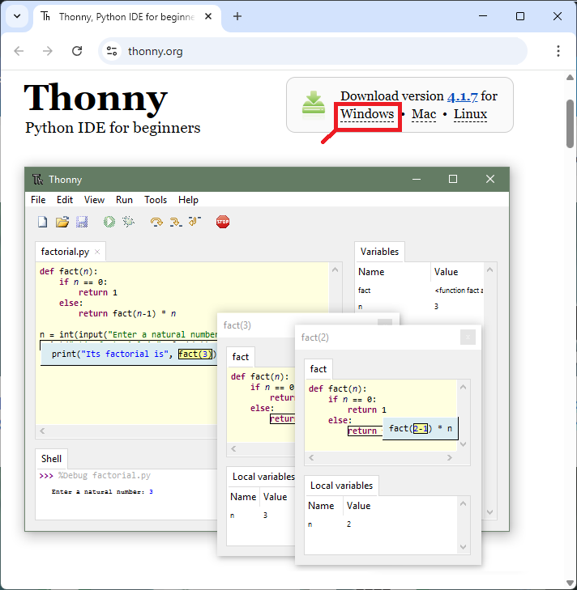

# Projeto do uso do MicroPython em Sistemas Embarcados

## Integrantes do grupo
* Afrain da Silva Calixto
* Alexandre Damaso Costa
* Flávio Lourenço da Silva
* Gustavo Adolpho Souteras Barbosa

## Seminário sobre Python: Técnicas e Abordagens Atuais 
- INSTITUTO FEDERAL DE EDUCAÇÃO, CIÊNCIA E TECNOLOGIA - GOIÁS 
- CAMPUS GOIÂNIA
- PÓS-GRADUAÇÃO EM INTELIGÊNCIA ARTIFICIAL APLICADA 
- DISCIPLINA: LINGUAGEM DE PROGRAMAÇÃO APLICADA 
- TURMA: 2026
- PROFESSOR: Otávio Calaça Xavier

## Material  
- ESP32 Wrown
- DHT11
- LCD 16x2 I2C
- Buzzer

## Instalação do IDE Thonny – PC com Windows

Para instalar o Thonny no seu PC com Windows, siga as próximas instruções:

**1.** Ir para [https://thonny.org](https://thonny.org/)

**2.** Baixe o Instalador para Windows e espere alguns segundos enquanto ele baixa.

**3.** Execute o _arquivo .exe_.

**4.** Siga o assistente de instalação para concluir o processo de instalação. Você só precisa clicar em "Próximo".

## Instalando o firmware MicroPython usando o IDE Thonny

Nesta seção, você vai aprender a instalar firmware MicroPython nas placas usando o IDE Thonny. Siga os próximos passos:

![](data:image/svg+xml;base64,PHN2ZyB3aWR0aD0iMTIiIGhlaWdodD0iOCIgdmlld0JveD0iMCAwIDEyIDgiIGZpbGw9Im5vbmUiIHhtbG5zPSJodHRwOi8vd3d3LnczLm9yZy8yMDAwL3N2ZyI+CjxwYXRoIGZpbGwtcnVsZT0iZXZlbm9kZCIgY2xpcC1ydWxlPSJldmVub2RkIiBkPSJNMTEuMjU5MiAwLjU4NjMwOUMxMC45NDk4IDAuNjc2MTIzIDEwLjM2OCAwLjg5ODU1NSAxMC4xNDE1IDEuMzQzNjJDOS45MjgxOSAxLjc2MjIxIDEwLjA2OSAyLjMzNzU0IDEwLjE5NzUgMi42N0MxMC41MDY3IDIuNTgwMjkgMTEuMDg5OSAyLjM1Nzg2IDExLjMxNjUgMS45MTIzOEMxMS41NDMyIDEuNDY3MzEgMTEuMzczMSAwLjg4MTIwOCAxMS4yNTkyIDAuNTg2MzA5VjAuNTg2MzA5Wk05LjkwMDYxIDMuMjU1OUw5LjgxMjMgMy4wODUyQzkuNzg4OTMgMy4wMzk3MyA5LjI0MjA5IDEuOTYyNzggOS42NzMwMyAxLjExNjg4QzEwLjEwMzYgMC4yNzA3NzggMTEuMzEzNiAwLjA0MzkzMjEgMTEuMzY0OCAwLjAzNDY5NEwxMS41NTc2IDBMMTEuNjQ1OSAwLjE3MDY5OUMxMS42NjkzIDAuMjE2MTcxIDEyLjIxNiAxLjI5MzAyIDExLjc4NDkgMi4xMzkxMkMxMS4zNTQ4IDIuOTg0ODIgMTAuMTQ0NyAzLjIxMTg3IDEwLjA5MzMgMy4yMjExMUw5LjkwMDYxIDMuMjU1OVoiIGZpbGw9IiM5MTkxOTEiLz4KPHBhdGggZmlsbC1ydWxlPSJldmVub2RkIiBjbGlwLXJ1bGU9ImV2ZW5vZGQiIGQ9Ik0yLjY0NDc1IDIuNjQ3NzlDMi41NzkxNyAxLjI4MzQzIDEuNDQwMjIgMC4xOTQ4NzggMC4wMzI5NTkgMC4xNjE2MjFWNS4zODI1NkMwLjAzNDAxMTYgNS4zODI1NiAwLjAzNTA2NDIgNS4zODI0NiAwLjAzNjExNjkgNS4zODIzNkMwLjEwMTY5NiA2Ljc0NjcyIDEuMjQwNjQgNy44MzUzNyAyLjY0NzkxIDcuODY4NTJWMi42NDc2OUMyLjY0Njg1IDIuNjQ3NjkgMi42NDU4IDIuNjQ3NzkgMi42NDQ3NSAyLjY0Nzc5IiBmaWxsPSIjOTE5MTkxIi8+CjxwYXRoIGZpbGwtcnVsZT0iZXZlbm9kZCIgY2xpcC1ydWxlPSJldmVub2RkIiBkPSJNNS43MTcyNiAyLjY0Nzc5QzUuNjUxNjggMS4yODM0MyA0LjUxMjczIDAuMTk0ODc4IDMuMTA1NDcgMC4xNjE2MjFWNS4zODI1NkMzLjEwNjUyIDUuMzgyNTYgMy4xMDc1NyA1LjM4MjQ2IDMuMTA4NzMgNS4zODIzNkMzLjE3NDIxIDYuNzQ2NzIgNC4zMTMxNSA3LjgzNTM3IDUuNzIwNTIgNy44Njg1MlYyLjY0NzY5QzUuNzE5NDcgMi42NDc2OSA1LjcxODMxIDIuNjQ3NzkgNS43MTcyNiAyLjY0Nzc5IiBmaWxsPSIjOTE5MTkxIi8+CjxwYXRoIGZpbGwtcnVsZT0iZXZlbm9kZCIgY2xpcC1ydWxlPSJldmVub2RkIiBkPSJNOC43OTAwMSAyLjY0Nzc5QzguNzI0MzMgMS4yODM0MyA3LjU4NTQ5IDAuMTk0ODc4IDYuMTc4MjIgMC4xNjE2MjFWNS4zODI1NkM2LjE3OTI4IDUuMzgyNTYgNi4xODAzMyA1LjM4MjQ2IDYuMTgxMzggNS4zODIzNkM2LjI0Njk2IDYuNzQ2NzIgNy4zODYwMSA3LjgzNTM3IDguNzkzMTcgNy44Njg1MlYyLjY0NzY5QzguNzkyMTIgMi42NDc2OSA4Ljc5MTA2IDIuNjQ3NzkgOC43OTAwMSAyLjY0Nzc5IiBmaWxsPSIjOTE5MTkxIi8+Cjwvc3ZnPgo=)

**1)** Conecte seu ESP32 ou placa ESP8266 ao seu computador.

**2)** Abra o IDE Thonny. Vá para **Ferramentas** > **Opções** > **Interpretador**.

**3)** Selecione o interprete que deseja usar de acordo com a placa que está usando e selecione a porta COM à qual sua placa está conectada. Por fim, clique no **link Instalar ou atualizar o MicroPython**.

**4)** Depois, selecione novamente a porta, a placa que você está usando e a variante. Ele detectará automaticamente a versão mais recente do firmware MicroPython — veja a captura de tela abaixo. Por fim, você pode clicar **em Instalar**.

![](data:image/svg+xml;base64,PHN2ZyB3aWR0aD0iMTIiIGhlaWdodD0iOCIgdmlld0JveD0iMCAwIDEyIDgiIGZpbGw9Im5vbmUiIHhtbG5zPSJodHRwOi8vd3d3LnczLm9yZy8yMDAwL3N2ZyI+CjxwYXRoIGZpbGwtcnVsZT0iZXZlbm9kZCIgY2xpcC1ydWxlPSJldmVub2RkIiBkPSJNMTEuMjU5MiAwLjU4NjMwOUMxMC45NDk4IDAuNjc2MTIzIDEwLjM2OCAwLjg5ODU1NSAxMC4xNDE1IDEuMzQzNjJDOS45MjgxOSAxLjc2MjIxIDEwLjA2OSAyLjMzNzU0IDEwLjE5NzUgMi42N0MxMC41MDY3IDIuNTgwMjkgMTEuMDg5OSAyLjM1Nzg2IDExLjMxNjUgMS45MTIzOEMxMS41NDMyIDEuNDY3MzEgMTEuMzczMSAwLjg4MTIwOCAxMS4yNTkyIDAuNTg2MzA5VjAuNTg2MzA5Wk05LjkwMDYxIDMuMjU1OUw5LjgxMjMgMy4wODUyQzkuNzg4OTMgMy4wMzk3MyA5LjI0MjA5IDEuOTYyNzggOS42NzMwMyAxLjExNjg4QzEwLjEwMzYgMC4yNzA3NzggMTEuMzEzNiAwLjA0MzkzMjEgMTEuMzY0OCAwLjAzNDY5NEwxMS41NTc2IDBMMTEuNjQ1OSAwLjE3MDY5OUMxMS42NjkzIDAuMjE2MTcxIDEyLjIxNiAxLjI5MzAyIDExLjc4NDkgMi4xMzkxMkMxMS4zNTQ4IDIuOTg0ODIgMTAuMTQ0NyAzLjIxMTg3IDEwLjA5MzMgMy4yMjExMUw5LjkwMDYxIDMuMjU1OVoiIGZpbGw9IiM5MTkxOTEiLz4KPHBhdGggZmlsbC1ydWxlPSJldmVub2RkIiBjbGlwLXJ1bGU9ImV2ZW5vZGQiIGQ9Ik0yLjY0NDc1IDIuNjQ3NzlDMi41NzkxNyAxLjI4MzQzIDEuNDQwMjIgMC4xOTQ4NzggMC4wMzI5NTkgMC4xNjE2MjFWNS4zODI1NkMwLjAzNDAxMTYgNS4zODI1NiAwLjAzNTA2NDIgNS4zODI0NiAwLjAzNjExNjkgNS4zODIzNkMwLjEwMTY5NiA2Ljc0NjcyIDEuMjQwNjQgNy44MzUzNyAyLjY0NzkxIDcuODY4NTJWMi42NDc2OUMyLjY0Njg1IDIuNjQ3NjkgMi42NDU4IDIuNjQ3NzkgMi42NDQ3NSAyLjY0Nzc5IiBmaWxsPSIjOTE5MTkxIi8+CjxwYXRoIGZpbGwtcnVsZT0iZXZlbm9kZCIgY2xpcC1ydWxlPSJldmVub2RkIiBkPSJNNS43MTcyNiAyLjY0Nzc5QzUuNjUxNjggMS4yODM0MyA0LjUxMjczIDAuMTk0ODc4IDMuMTA1NDcgMC4xNjE2MjFWNS4zODI1NkMzLjEwNjUyIDUuMzgyNTYgMy4xMDc1NyA1LjM4MjQ2IDMuMTA4NzMgNS4zODIzNkMzLjE3NDIxIDYuNzQ2NzIgNC4zMTMxNSA3LjgzNTM3IDUuNzIwNTIgNy44Njg1MlYyLjY0NzY5QzUuNzE5NDcgMi42NDc2OSA1LjcxODMxIDIuNjQ3NzkgNS43MTcyNiAyLjY0Nzc5IiBmaWxsPSIjOTE5MTkxIi8+CjxwYXRoIGZpbGwtcnVsZT0iZXZlbm9kZCIgY2xpcC1ydWxlPSJldmVub2RkIiBkPSJNOC43OTAwMSAyLjY0Nzc5QzguNzI0MzMgMS4yODM0MyA3LjU4NTQ5IDAuMTk0ODc4IDYuMTc4MjIgMC4xNjE2MjFWNS4zODI1NkM2LjE3OTI4IDUuMzgyNTYgNi4xODAzMyA1LjM4MjQ2IDYuMTgxMzggNS4zODIzNkM2LjI0Njk2IDYuNzQ2NzIgNy4zODYwMSA3LjgzNTM3IDguNzkzMTcgNy44Njg1MlYyLjY0NzY5QzguNzkyMTIgMi42NDc2OSA4Ljc5MTA2IDIuNjQ3NzkgOC43OTAwMSAyLjY0Nzc5IiBmaWxsPSIjOTE5MTkxIi8+Cjwvc3ZnPgo=)

**Observação**: Em algumas placas ESP8266, talvez seja necessário tentar diferentes opções para o **modo Flash** e selecionar _detectar_ para o **tamanho do Flash**.

Após alguns segundos, a instalação deve estar concluída. Se você estiver usando um ESP32, pode ser necessário pressionar o botão BOOT por alguns segundos após clicar no _botão Instalar_.

5) Quando a instalação estiver concluída, você pode fechar a janela. Você deve receber a seguinte mensagem no Shell (veja a imagem abaixo), e no canto inferior direito, deve estar o Interpretador que está usando e a porta COM.

## 🛠️ Esquema de Ligação (Pinagem)
Abaixo estão as conexões necessárias para o Raspberry Pi Pico (2020), o sensor DHT11 e o Display LCD 16x2 com módulo I2C.

| Componente | Pino no Componente | Pino no Raspberry Pi Pico | Descrição |
| :--- | :--- | :--- | :--- |
| **DHT11** | VCC | 3V3 (Pino 36) | Alimentação 3.3V |
| | DATA | GP28 (Pino 34) | Sinal de Dados |
| | NC | - | Não Conectado (apenas p/ módulo 4 pinos) |
| | GND | GND (Pino 38 ou 3) | Terra |
| **LCD 16x2 I2C** | VCC | VBUS (Pino 40) | Alimentação 5V (Recomendado p/ o LCD) |
| | GND | GND (Pino 38 ou 3) | Terra |
| | SDA | GP21 (Pino 21) | Dados I2C0 SDA |
| | SCL | GP22 (Pino 22) | Clock I2C0 SCL |

---  
